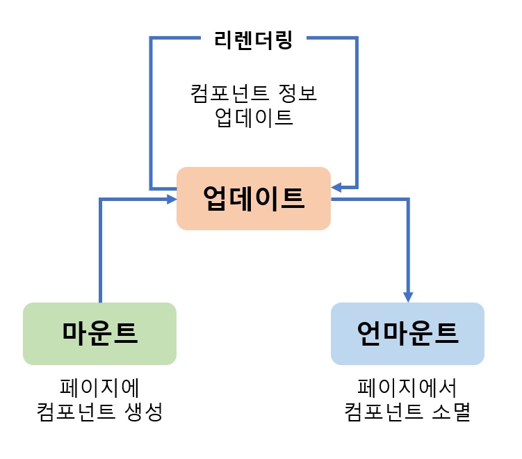
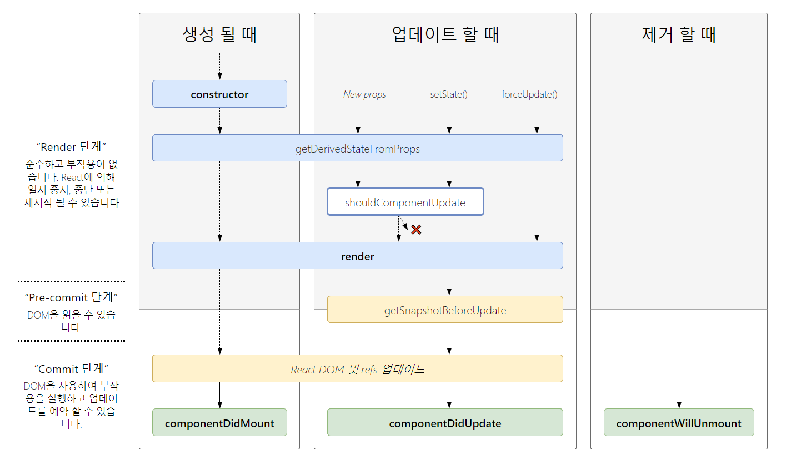

# 컴포넌트의 생명주기
> 컴포넌트에는 라이프 사이클(수명 주기)이 존재합니다.

컴포넌트의 수명은 페이지에 준비 과정(렌더링 되기 전)부터 페이지에서 사라질 때(컴포넌트 제거) 종료됩니다.

## 라이프사이클 메서드
> 라이프사이클 메서드는 총 9개입니다.

**Will** 접두사가 붙은 메서드는 특정 작업 **전**에, **Did** 접두사가 붙은 메서드는 특정 작업 **후**에 실행됩니다.

라이프사이클은 총 세 가지 맥락으로 나눕니다. **마운트**, **업데이트**, **언마운트**.

<br>

<div align='center'>



</div>

<br>

- 마운트(Mount) : DOM이 생성되고 웹 브라우저 상에 나타납니다.
  1. 컴포넌트 생성
  2. `constructor` : 컴포넌트를 새로 만들 때마다 호출되는 클래스 생성자 메서드
  3. `getDerivedStateFromProps`: props에 있는 값을 state에 넣을 때 사용하는 메서드
  4. `render`: 준비한 UI를 렌더링하는 메서드
  5. `componentDidMount`: 컴포넌트가 웹 브라우저상에 나타난 후 호출하는 메서드

<br>

- 업데이트(Update) : 컴포넌트는 다음과 같은 총 네 가지 경우 업데이트합니다.
  1. props가 바뀔 때
  2. state가 바뀔 때
  3. 부모 컴포넌트가 리렌더링될 때
  4. `this.forceUpdate()`로 강제 렌더링을 트리거할 때

  <br>

  > 컴포넌트는 `props 변경`, `state 변경`, `부모 컴포넌트의 리렌더링` 시 업데이트 됩니다. 순서는 아래와 같습니다.
  1. 업데이트 요인 발생(props 변경, state 변경, 부모 컴포넌트의 리렌더링)
  2. `getDerivedStateFromProps`: 마운트 과정에서도 호출되지만 업데이트가 시작하기 전에도 호출됩니다. props의 변화에 따라 state 값에도 변화를 주고 싶을 때 사용합니다.
  3. `shouldComponentUpdate`: 컴포넌트가 리렌더링을 할지 결정하는 메서드로 true, false를 반환해야 합니다. 단, 특정 함수에서 `this.forceUpdate()`를 호출하면 이 과정을 생략하고 바로 render 함수를 호출합니다.
  4. `render`: 컴포넌트를 리렌더링합니다.
  5. `getSnapshotBeforeUpdate`: 컴포넌트 변화를 DOM에 반영하기 바로 직전에 호출되는 메서드`
  6. `componentDidUpdate`: 컴포넌트의 업데이트 작업이 끝난 후 호출하는 메서드

<br>

- 언마운트(Unmount) : 마운트의 반대 과정으로 컴포넌트를 DOM에서 제거합니다.
  - `componentWillUnmount`: 컴포넌트가 웹 브라우저상에서 소멸되기 전에 호출하는 메서드

<br>

## 라이프사이클 메서드 뜯어보기
### render
> 라이프사이클 중 유일한 필수 메서드입니다.

- this.props, this.state에 접근할 수 있으며 리액트 요소를 반환합니다.
- null, false 값을 반환함으로 아무것도 렌더링하지 않을 수 있습니다.
- 이벤트 설정이 아닌 곳에서 setState를 사용하거나 브라우저 DOM에 접근해서도 안 됩니다. componentDidMount에서 처리하세요.

<br>

### constructor
> 초기 state를 설정합니다.

<br>

### getDerivedStateFromProps
> 16.3 이후에 등장했으며 props로 받은 값을 state에 동기화시키는 용도로 사용됩니다.

컴포넌트가 마운트될 때와 업데이트 될 때 호출됩니다.
```js
static getDerivedStateFromProps(nextProps, prevState){
  if(nextProps.value !== prevState.value){
    // 조건에 따른 특정 값 동기화
    return { value: nextProps.value };
  }
  // state를 변경할 필요가 없다면 null 반환
  return null;
}
```

<br>

### componentDidMount
> 첫 렌더링을 마친 후 실행됩니다.

자바스크립트 라이브러리/프레임워크를 호출하거나 이벤트를 등록하고 setTimeout, setInterval, 네트워크 요청 같은 비동기 작업을 처리할 수 있습니다.

<br>

### shouldComponentUpdate
> props 또는 state를 변경했을 때 리렌더링 여부를 지정하는 메서드입니다.

- 반드시 true/false 값을 반환해야 하며, 메서드를 생성하지 않으면 기본 값으로 true가 제공됩니다.
- false를 반환하는 경우 업데이트 과정은 중단됩니다.
- 현재 props/state는 this.props/this.state로, 새로 설정될 props/state는 nextProps/nextState로 접근할 수 있습니다.
- 컴포넌트 최적화 시 상황에 맞는 알고리즘을 작성하여 불필요한 리렌더링을 방지할 때 자주 사용합니다.

<br>

### getSnapshotBeforeUpdate
> 16.3 이후에 등장했으며 render에서 만들어진 결과물이 브라우저에 실제로 반영되기 직전에 호출됩니다.

- 이 메서드에서 반환하는 값은 componentDidUpdate에서 `세 번째 파라미터인 snapshot` 값으로 전달 받을 수 있습니다.
- 주로 업데이트 직전의 값을 참조할 때 사용됩니다(스크롤바 위치 등).

```js
getSnapshotBeforeUpdate(prevProps, prevState){
  if(prevState.array !== this.state.array){
    const { scrollTop, scrollHeight } = this.list;
    return { scrollTop, scrollHeight };
  }
}
```

<br>

### componentDidUpdate
> 리레더링을 완료한 후 실행합니다.

- 업데이트가 끝난 직후이므로 DOM 관련 처리를 해도 좋습니다.
- prevProps, prevState를 사용하여 컴포넌트가 이전에 가졌던 데이터에 접근할 수 있습니다.
- getSnapshotBeforeUpdate에서 반환한 값이 있다면 snapshot 값을 전달받을 수 있습니다.

<br>

### componentWillUnmount
> 컴포넌트를 DOM에서 제거할 때 실행합니다.

componentDidMount에서 등록한 이벤트, 타이머, 직접 생성한 DOM이 있다면 여기서 제거합니다.

<br>

### componentDidCatch
> 16 이후에 등장했으며 컴포넌트 렌더링 중 에러가 발생해도 애플리케이션이 멈추지 않고 오류 UI를 보여 줄 수 있게 합니다.

```js
componentDidCatch(error, info){
  this.setState({
    error: true
  });
  console.log({ error, info });
}
```
- error : 파라미터에 어떤 에러가 발생했는지 알려줍니다.
- info : 어디에 있는 코드에서 오류가 발생했는지 알려줍니다.

그러나 이 메서드로는 자신의 this.props.children으로 전달되는 컴포넌트에서 발생하는 에러만 잡아낼 수 있습니다. 즉, 자신에게 발생하는 에러는 모른다는 것이죠.

<br>

## 정리

<br>

<div align='center'>



</div>

<br>
