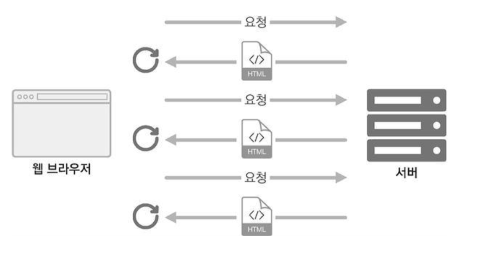

# 리액트 라우터로 SPA 개발하기
> SPA(Single Page Application)는 한 개의 페이지로 이루어진 애플리케이션입니다.

<br>

<div align='center'>



</div>

<br>

사용자가 다른 페이지로 이동할 때마다 새로운 리소스(html)를 요청하여 페이지를 로딩할 때마다 서버에서 리소스를 응답 받아 해석한 뒤 화면에 출력했습니다. 서버 측에서 사용자에게 보이는 화면을 제공하기 위해 html을 미리 만들어 놓거나 데이터에 따라 유동적인 html을 생성하는 템플릿 엔진을 사용하기도 했습니다.

현대의 웹은 정보가 너무 방대하여 새로운 화면으로 이동할 때마다 서버 측에서 모든 페이지를 준비한다면 성능 상 문제가 발생할 수 있습니다. 트래픽이 많이 나온다거나, 서버에 부하가 걸리는 등 말이죠. 속도 및 트래픽 측면에서 `캐싱과 압축`을 통해 서비스를 제공한다면 어느 정도 최적화할 수 있지만 **사용자와의 인터렉션이 자주 발생하는 모던 웹**에서는 적당하지 않을 수 있게 된 겁니다. 화면 전환이 일어날 때마다 html을 새로 요청하면 사용자의 상태를 유지하는 것도, 바뀔 이유가 없는 부분도 새로 불러오는 불필요한 로딩도 비효율적이었습니다.

결국 리액트 같은 라이브러리나 프레임워크를 사용하여 페이지 렌더링은 브라우저가 담당하고, 우선 애플리케이션을 실행시킨 후 사용자와의 인터랙션이 발생하면 필요한 부분만 자바스크립트를 사용하여 업데이트합니다. 새로운 데이터가 필요하면 서버 API를 호출해서 해당 데이터만 가져와 웹에서 사용할 수 있었죠.

<br>

<div align='center'>


</div>

<br>

SPA의 경우 서버에서 사용자에게 제공하는 페이지는 하나이지만 자바스크립트와 브라우저 주소 상태에 따라 다양한 화면을 보여 줄 수 있습니다.

다른 주소에서 다른 화면을 보여 주는 것을 **라우팅**이라고 합니다. 브라우저 API를 직접 사용하여 이를 관리하거나, 라이브러리를 사용하여 이런 작업을 더욱 쉽게 구현할 수 있죠.

<br>

## SPA의 단점
> 앱의 규모가 커지면 자바스크립트 파일이 너무 커집니다.

페이지 로딩 시 사용자가 실제 방문하지 않을 수 있는 페이지의 스크립트도 불러오므로 너무 방대해집니다. 그러나 코드 스플리팅(Code Spliting)을 통해 라우트별로 파일을 나누어 트래픽과 로딩 속도를 개선할 수 있습니다.

브라우저에서 자바스크립트를 사용하여 라우팅을 관리하는 것은 일반 크롤러가 페이지 정보를 제대로 수집하지 못하는 잠재적인 단점이 존재합니다. 따라서 검색 엔진에 제대로 조회되지 않을 수 있죠. 또한 자바스크립트가 실행될 때까지 페이지가 비어 있으므로 자바스크립트가 로딩되는 짧은 시간에 흰 페이지가 나타날 수도 있습니다.

이러한 문제는 서버 사이드 렌더링(Server Side Rendering)을 통해 모두 해결할 수 있습니다.

<br>

## 기본 사용법
`src/index.js` 파일에서 `react-router-dom`에 내장된 `BrowserRouter`라는 컴포넌트를 사용하여 감싸기만 하면 됩니다.

```js
import React from 'react';
import ReactDOM from 'react-dom';
import { BrowserRouter } from 'react-router-dom';
import './index.css';
import App from './App';

ReactDOM.render(
  <BrowserRouter>
    <React.StrictMode>
      <App />
    </React.StrictMode>
  </BrowserRouter>,
  document.getElementById('root')
);
```
- 웹 어플리케이션 HTML5의 History API를 사용하여 페이지를 새로고침 없이 주소를 변경할 수 있게 해줍니다.
- 또한 현재 주소에 관련된 정보를 props로 쉽게 조회하거나 사용할 수 있게 해줍니다.

Router를 사용하는 방식은 아래와 같습니다.
```js
<Router path="주소 규칙" component={보여 줄 컴포넌트} />
```

```js
import React from 'react';
import { Route } from 'react-router-dom';
import Home from './components/Home'
import About from './components/About';

const App = () => {
  return (
    <div>
      <Route path="/" component={Home} exact={true}></Route>
      <Route path="/about" component={About}></Route>
    </div>
  )
}

export default App
```
- exact가 없다면 `/` 경로 규칙과 `/about` 경로 규칙이 일치하여 두 컴포넌트가 같이 출력되게 됩니다.

<br>

### Link 컴포넌트를 사용하여 다른 주소 이동하기
> Link 컴포넌트는 클릭 시 다른 주소로 이동시켜 주는 컴포넌트입니다.

a 태그는 페이지를 전환하는 과정에서 페이지를 새로 불러오므로 애플리케이션이 가진 상태를 모두 초기화시킵니다. 그러나 Link 컴포넌트로 페이지를 전환하면 애플리케이션을 유지하면서 History API를 사용해 페이지 주소만 변경합니다. Link 태그는 a 태그로 개발되었지만 페이지 전환을 방지하는 기능이 내장되어 있습니다.

```js
<Link to="주소">내용</Link>
```

<br>

### Route 하나에 여러 path 설정하기
리액트 라우터 v5부터 Route 하나에 여러 path를 설정할 수 있게 지원합니다. 아래와 같이 말이죠.

```js
import React from 'react';
import { Route } from 'react-router-dom';
import Home from './components/Home'
import About from './components/About';

const App = () => {
  return (
    <div>
      <Route path="/" component={Home} exact={true}></Route>
      <Route path={["/about", "/info"]} component={About}></Route>
    </div>
  )
}

export default App
```

<br>

## URL 파라미터와 쿼리
> 페이지 주소를 정의할 때 유동적인 값을 전달해야 할 때가 있습니다.

- 파라미터 : `/profile/test`
- 쿼리 : `/about?detail=true&foward=false`

무조건적으로 파라미터나 쿼리를 사용해야하는 규칙은 없습니다. 일반적인 코드 표준을 따라가면 돼요. 파라미터는 특정 아이디 또는 이름을 사용하여 조회할 때, 쿼리는 특정 키워드를 검색하거나 페이지에 필요한 옵션을 전달할 때 사용합니다.

### URL 파라미터
라우트로 사용되는 컴포넌트에서 전달 받는 `match`라는 객체 안의 params 값을 참조합니다. match 객체 안에는 현재 컴포넌트가 어떤 경로 규칙에 의해 보이는지가 들어 있습니다.

```js
import React from 'react'

const data = {
  tester: {
    name: '테스터',
    description: '테스트 유저'
  },
  tester1: {
    name: 'TESTER',
    description: 'Test User'
  }
};

const Profile = ({ match }) => {
  const { username } = match.params;
  const profile = data[username];

  if (!profile) return <div>존재하지 않는 사용자입니다.</div>

  return (
    <div>
      <h3>
        {username}({profile.name})
      </h3>
      <p>{profile.description}</p>
    </div>
  )
}

export default Profile
```
```js
import React from 'react';
import { Link, Route } from 'react-router-dom';
import Home from './components/Home'
import About from './components/About';
import Profile from './components/Profile';

const App = () => {
  return (
    <div>
      <ul>
        <li>
          <Link to="/">Home</Link>
        </li>
        <li>
          <Link to="/about">소개</Link>
        </li>
        <li>
          <Link to="/profile/tester">테스터 프로필</Link>
        </li>
        <li>
          <Link to="/profile/tester1">TESTER 프로필</Link>
        </li>
      </ul>
      <hr />
      <Route path="/" component={Home} exact={true}></Route>
      <Route path="/about" component={About}></Route>
      <Route path="/profile/:username" component={Profile}></Route>
    </div>
  )
}

export default App
```

<br>

### URL 쿼리
쿼리는 location 객체의 search 값에서 조회할 수 있습니다. location 객체는 라우트로 사용된 컴포넌트에게 props로 전달되며, 웹 애플리케이션의 현재 주소에 대한 정보를 가지고 있습니다.

- `http://localhost:3000/about?detail=true&foward=false` 주소일 때의 값입니다.
  ```json
  {
    "pathname": "/about",
    "search": "?detail=true&foward=false",
    "hash: "",
  }
  ```

URL 쿼리를 읽을 때는 위 객체의 search 값을 확인하는데, 이 값은 문자열 형태입니다. searc 값에서 특정 값을 읽어 오기 위해서 이 문자열을 객체 형태로 반환하죠. 보통 쿼리 문자열을 객체로 변환할 때는 `qs`라는 라이브러리를 사용합니다.

```sh
npm i qs
```
```js
import React from 'react'
import qs from 'qs';

const About = ({ location }) => {
  const query = qs.parse(location.search, {
    ignoreQueryPrefix: true // 이 설정이 있어야 문자열의 ? 를 생략합니다.
  });
  const showDetail = query.detail === 'true';
  return (
    <div>
      <h1>소개</h1>
      <p>이 프로젝트는 리액트 라우터 기초를 실습합니다.</p>
      {showDetail && <p>detail 값을 true로 설정했네요?</p>}
    </div>
  )
}

export default About
```

쿼리의 결과 값은 항상 문자열임을 유의하세요.

<br>

## 서브 라우트
> 라우트 내에 또 라우트를 정의하는 것입니다.

단순하게 라우트로 사용되는 컴포넌트 내부에 Route 컴포넌트를 또 사용하는 것이죠.

```js
import React from 'react'
import { Link, Route } from 'react-router-dom'
import Profile from './Profile'

const Profiles = () => {
  return (
    <div>
      <h3>사용자 목록:</h3>
      <ul>
        <li>
          <Link to="/profiles/tester">테스터</Link>
        </li>
        <li>
          <Link to="/profiles/tester1">TESTER</Link>
        </li>
      </ul>
      <Route
        path="/profiles"
        exact
        render={() => <div>사용자를 선택해 주세요.</div>}
      />
      <Route
        path="/profiles/:username"
        component={Profile}
      />
    </div>
  )
}

export default Profiles
```

첫 번째 컴포넌트에는 component 대신 render라는 props를 넣어 주었는데, 컴포넌트 자체가 아니라 보여주고 싶은 JSX를 넣어 줄 수 있습니다. 컴포넌트를 따로 분리하기 애매하거나 props를 별도로 넣어주고 싶을 때도 사용할 수 있죠.

JSX에서 props를 설정할 때 값을 생략하면 자동으로 `true`가 됩니다. 즉, `exact`는 `exact={true}`와 같은 의미죠.

<br>

## 리액트 라우터 부가 기능
### history
> 라우트로 사용된 컴포넌트에 전달되는 props 중 하나로 컴포넌트 내에 구현하는 메서드에서 라우터 API를 호출할 수 있습니다.

[예제 페이지]()

<br>

### withRouter
> HOC(High Order Component)로서 라우터로 사용된 컴포넌트가 아닐지라도 match, loaction, history 객체를 접근할 수 있습니다.

[예제 페이지]()

withRouter를 사용할 때는 컴포넌트를 export할 때 함수로 감싸 줍니다.
```js
export default withRouter(WithRouter);
```

withRouter를 사용하면 현재 자신을 보여 주고 있는 라우트 컴포넌트(Profiles 기준)으로 match가 전달되는데, Profiles를 위한 라우트를 설정할 때는 `path="/profiles"`라고만 입력했으므로 username 파라미터를 읽지 못합니다.

WithRouter 컴포넌트를 Profiles에서 지우고 Profile 컴포넌트에 넣으면 match 쪽에 URL 파라미터가 제대로 보이게 돼죠.

<br>

### Switch
> Swtich 컴포넌트는 여러 Route를 감싸 일치하는 단 하나의 라우트만을 렌더링합니다. Switch를 사용하면 Not Found 페이지를 쉽게 구현할 수 있습니다.

```js
  //...
    <Switch>
      <Route path="/" component={Home} exact={true}></Route>
      <Route path="/about" component={About}></Route>
      <Route path="/profiles" component={Profiles}></Route>
      <Route path="/history" component={History}></Route>
      <Route
        render={({location}) => {
          <div>
            <h2>이 페이지는 존재하지 않습니다:</h2>
            <p>{location.pathname}</p>
          </div>
        }}
      />
    </Switch>
  //...
export default App;
```
- path를 따로 정의하지 않으면 모든 상황에 렌더링됩니다.

<br>

### NavLink
> Link와 비슷하며 현재 경로와 Link에 사용하는 경로가 일치하는 경우 특정 스타일 또는 CSS 클래스를 적용할 수 있는 컴포넌트입니다.

NavLink에서 링크 활성화 시 스타일은 activeStyle 값을, CSS 클래스를 적용할 때는 activeClassName 값을 props로 넣어 주면 됩니다.

<br>

## 정리
이러한 라우팅은 편리하지만 문제가 있습니다. 바로 웹 브라우저에서 사용하는 컴포넌트, 상태 관리 로직, 그 외 여러 기능을 구현하는 함수가 쌓이면 자바스크립트 파일의 크기가 방대해진다는 것이죠.

현재 프로젝트는 사용자가 /about 페이지에 들어왔을 때 필요하지 않은 Profile 컴포넌트까지 불러옵니다. 라우트에 따라 필요한 컴포넌트만 불러오고, 다른 컴포넌트는 다른 페이지를 방문하는 등 필요한 시점에 불러오면 더 효율적이겠죠? 이를 해결해 주는 것이 코드 스플리팅입니다.