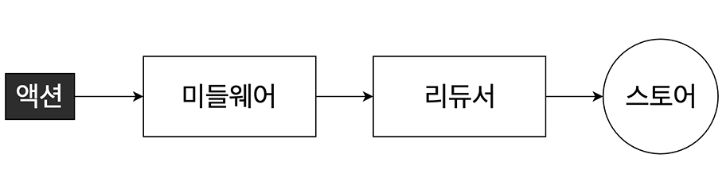
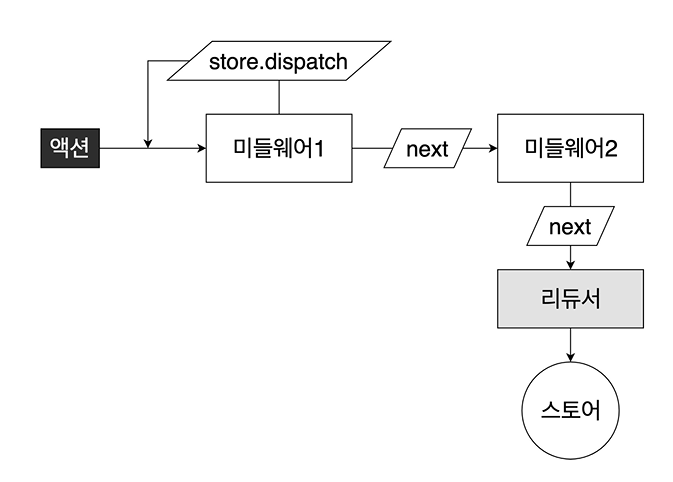

# 리덕스 미들웨어
리덕스로 상태 관리 중이고 비동기 작업을 진행해야 한다면 `미들웨어(Middleware)`를 사용하여 효율적이고 편하게 상태 관리를 할 수 있습니다.

## 미들웨어
> 미들웨어는 액션과 리듀서 사이의 중간 제어자라고 볼 수 있습니다.

리덕스 미들웨어는 액션을 디스패치할 때 리듀서에서 이를 처리하기 앞서 사전에 지정된 작업을 실행합니다.

<br>

<div align='center'>



</div>

<br>

전달받은 액션을 콘솔에 기록하거나, 액션 정보를 기반으로 액션을 취소하거나, 다른 액션을 추가로 dispatch 하는 등 여러 작업을 할 수 있습니다.

### 미들웨어 생성
미들웨어는 기본적으로 이렇게 구성됩니다.
```js
const loggerMiddleware = store => next => (action) => {
  // 미들웨어 기본 구조
};

export default loggerMiddleware;
```

이를 풀어 쓴다면 아래와 같죠.
```js
const loggerMiddleware = (store) => {
  return (next) => {
    return (action) => {
      // 미들웨어 기본 구조
    }
  }
}
```

결국 함수를 반환하는, 또 함수를 반환하는 함수입니다. store는 리덕스 스토어 인스턴스를, action은 디스패치된 액션을, next는 함수 형태의 파라미터입니다.

next는 store.dispatch와 비슷한 역할을 하며 next(action)을 호출하면 다음 처리해야 할 미들웨어에게 액션을 넘겨주고, 미들웨어가 없다면 리듀서에게 액션을 넘겨줍니다.

<br>

<div align='center'>



</div>

<br>

미들웨어 내부에서 store.dispatch를 사용하면 첫 번째 미들웨어부터 다시 처리합니다. 미들웨어에서 next를 사용하지 않으면 액션이 리듀서에 전달되지 않죠. 즉, 액션이 무시되는 것입니다.

위의 미들웨어를 완성시켜 볼까요?
```js
const loggerMiddleware = store => next => (action) => {
  console.group(action && action.type);
  console.log('이전 상태', store.getStore());
  console.log('액션', action);
  next(action);
  console.log('다음 상태', store.getState());
  console.groupEnd();
};

export default loggerMiddleware;
```

이를 redux에 적용해보면 아래와 같습니다.
```js
import React from 'react';
import ReactDOM from 'react-dom';
import { applyMiddleware, createStore } from 'redux';
import { Provider } from 'react-redux';
import './index.css';
import App from './App';
import rootReducer from './modules';
import loggerMiddleware from './lib/loggerMiddleware';

const store = createStore(rootReducer, applyMiddleware(loggerMiddleware));

ReactDOM.render(
  <Provider store={store}>
    <React.StrictMode>
      <App />
    </React.StrictMode>
  </Provider>,
  document.getElementById('root'),
);
```

이러면 액션 정보, 업데이트 상태가 잘 표시될 겁니다. 이런 미들웨어 속성을 사용해서 네트워크 요청과 같은 비동기 작업을 관리하면 매우 유용합니다.

<br>

## redux-logger 사용하기
```sh
npm i redux-logger
```
```js
import React from 'react';
import ReactDOM from 'react-dom';
import { applyMiddleware, createStore } from 'redux';
import { Provider } from 'react-redux';
import './index.css';
import App from './App';
import rootReducer from './modules';
// import loggerMiddleware from './lib/loggerMiddleware';
import { createLogger } from 'redux-logger';

const logger = createLogger();
const store = createStore(rootReducer, applyMiddleware(logger));

ReactDOM.render(
  <Provider store={store}>
    <React.StrictMode>
      <App />
    </React.StrictMode>
  </Provider>,
  document.getElementById('root'),
);
```

<br>

## 비동기 처리 미들웨어
대표적으로 사용하는 두 라이브러리를 보죠.
- redux-thunk : 객체가 아닌 함수 형태의 액션을 디스패치할 수 있게 도와줍니다.
- redux-saga : 특정 액션이 디스패치되었을 때 정해진 로직에 따라 다른 액션을 디스패치시키는 규칙을 작성하여 비동기 작업을 처리할 수 있게 합니다.

<br>

### redux-thunk
Thunk는 특정 작업을 미뤄 나중에 처리하도록 함수 형태로 감싼 것입니다.

이렇게 말이죠.
```js
const addone = x => x + 1;
function addOneThunk(x){
  const thunk = () => addOne(x);
  return thunk;
}

const fn = addOneThunk(1);
setTimeout(() => {
  const value = fn();
  console.log(value);
}, 1000)
```

만약 addOneThunk를 화살표 함수로만 사용한다면 다음과 같습니다.
```js
const addone = x => x + 1;
const addOneThunk = (x) => () => addOne(x);

const fn = addOneThunk(1);
setTimeout(() => {
  const value = fn();
  console.log(value);
}, 1000)
```

redux-thunk를 사용하면 thunk 함수를 만들어 dispatch할 수 있으며, 리덕스 미들웨어가 그 함수를 전달받아 store의 dispatch와 getState를 파라미터로 넣어 호출합니다.
```js
const sampleThunk = () => (dispatch, getState) => {
  // 현재 상태를 참조하거나 새 액션을 디스패치할 수 있습니다.
}
```

<br>

- 적용
  ```sh
  npm i redux-thunk
  ```
  ```js
  import React from 'react';
  import ReactDOM from 'react-dom';
  import { applyMiddleware, createStore } from 'redux';
  import { Provider } from 'react-redux';
  import './index.css';
  import App from './App';
  import rootReducer from './modules';
  // import loggerMiddleware from './lib/loggerMiddleware';
  import { createLogger } from 'redux-logger';
  import ReduxThunk from 'redux-thunk';

  const logger = createLogger();
  const store = createStore(rootReducer, applyMiddleware(logger, ReduxThunk));

  ReactDOM.render(
    <Provider store={store}>
      <React.StrictMode>
        <App />
      </React.StrictMode>
    </Provider>,
    document.getElementById('root'),
  );
  ```

<br>

- Thunk 생성 함수 만들기
  ```js
  import { createAction, handleActions } from 'redux-actions';

  const INCREASE = 'counter/INCREASE';
  const DECREASE = 'counter/DECREASE';

  export const increase = createAction(INCREASE);
  export const decrease = createAction(DECREASE);

  export const increaseAsync = () => (dispatch) => {
    setTimeout(() => {
      dispatch(increase());
    }, 1000);
  };

  export const decreaseAsync = () => (dispatch) => {
    setTimeout(() => {
      dispatch(decrease());
    }, 1000);
  };

  const initialState = 0;

  const counter = handleActions(
    {
      [INCREASE]: state => state +1,
      [DECREASE]: state => state -1,
    },
    initialState,
  );

  export default counter;
  ```
  ```js
  import React from 'react';
  import { connect } from 'react-redux';
  import { increaseAsync, decreaseAsync } from '../modules/counter';
  import Counter from '../components/Counter';

  const CounterContainer = ({ number, increaseAsync, decreaseAsync }) => {
    return (
      <Counter number={number} onIncrease={increaseAsync} onDecrease={decreaseAsync} />
    );
  };


  export default connect(
    state => ({
      number: state.counter,
    }),
    {
      increaseAsync,
      decreaseAsync,
    },
  )(CounterContainer);
  ```

<br>

### redux-saga
redux-saga는 이러한 상황에서 좀 더 유리합니다.
1. 기존 요청을 취소 처리해야 할 때(불필요한 중복 요청 방지)
2. 특정 액션이 발생했을 때 다른 액션도 발생시키거나 API 요청 등 관계없는 코드를 실행할 때
3. 웹소켓을 사용할 때
4. API 요청 실패 시 재요청할 때

redux-saga는 ES6의 제네레이터(generator) 함수를 사용하므로 이를 이해하지 못하면 어려울 수 있습니다. 핵심은 `함수를 특정 구간에 멈춰 놓거나, 실행시킬 수 있다는 것`입니다. 제네레이터가 처음 생성되면 함수의 흐름은 중지된 상태입니다. `next()`가 호출되면 다음 `yield` 키워드가 있는 부분까지 호출한 뒤 다시 멈춥니다. 따라서 제네레이터 함수를 사용해 도중에 멈출 수 있고 순차적으로 여러 값을 반환시킬 수 있습니다. 또한 next 함수에 파라미터를 넣으면 제네레이터 함수에서 yield를 사용해 해당 값을 조회할 수도 있죠.

redux-saga는 제네레이터 함수 문법을 기반으로 비동기 작업을 관리합니다. 우리가 디스패치하는 액션을 모니터링해서 그에 따른 작업을 따로 수행할 수 있는 미들웨어죠. 동작 흐름은 이렇습니다.
```js
function* watchGenerator() {
  console.log('모니터링 중');
  let prevAction = null;
  while(true){
    const action = yield;
    console.log('이전 액션 : ', prevAction);
    prevAction = action;
    if(action.type === 'HELLO'){
      console.log('안뇽!');
    }
  }
}

const watch = watchGenerator();

watch.next();
watch.next({ type: 'TEST'});
watch.next({ type: 'HELLO'});
```

- 설치
  ```sh
  npm i redux-saga
  ```

- saga 생성 : 제네레이터 함수를 saga라고 합니다.
  ```js
  import { createAction, handleActions } from 'redux-actions';
  import { delay, put, takeEvery, takeLatest } from 'redux-saga/effects';

  const INCREASE = 'counter/INCREASE';
  const DECREASE = 'counter/DECREASE';

  const INCREASE_ASYNC = 'counter/INCREASE_ASYNC';
  const DECREASE_ASYNC = 'counter/DECREASE_ASYNC';

  export const increase = createAction(INCREASE);
  export const decrease = createAction(DECREASE);

  // 마우스 클릭 이벤트가 payload 안에 들어가지 않게
  // () => undefined를 두 번째 파라미터로 넣어 줍니다.
  export const increaseAsync = createAction(INCREASE_ASYNC, () => undefined);
  export const decreaseAsync = createAction(DECREASE_ASYNC, () => undefined);

  function* increaseSaga(){
    yield delay(1000); // 1초 대기
    yield put(increase()); // 특정 액션 디스패치
  }

  function* decreaseSaga(){
    yield delay(1000); // 1초 대기
    yield put(decrease()); // 특정 액션 디스패치
  }

  export function* counterSaga(){
    // takeEvery는 들어오는 모든 액션에 대해 특정 작업을 처리합니다.
    yield takeEvery(INCREASE_ASYNC, increaseSaga);
    // takeLatest는 기존 진행 중인 작업을 취소하고 가장 마지막 작업만 실행합니다.
    yield takeLatest(DECREASE_ASYNC, decreaseSaga);
  }

  const initialState = 0;

  const counter = handleActions(
    {
      [INCREASE]: state => state +1,
      [DECREASE]: state => state -1,
    },
    initialState,
  );

  export default counter;
  ```

- 루트 사가 등록 : 다른 리듀서에서도 사가를 만들어 등록합니다.
  ```js
  import { combineReducers } from 'redux';
  import { all } from 'redux-saga/effects';
  import counter, { counterSaga } from './counter';
  import sample from './sample';
  import loading from './loading';

  const rootReducer = combineReducers({
    counter,
    sample, 
    loading,
  });

  export function* rootSaga(){
    // all 함수는 여러 saga를 합쳐줍니다.
    yield all([ counterSaga() ]);
  }

  export default rootReducer;
  ```

- 적용
  ```js
  import React from 'react';
  import ReactDOM from 'react-dom';
  import { applyMiddleware, createStore } from 'redux';
  import { Provider } from 'react-redux';
  import './index.css';
  import App from './App';
  import rootReducer, { rootSaga } from './modules';
  // import loggerMiddleware from './lib/loggerMiddleware';
  import { createLogger } from 'redux-logger';
  import ReduxThunk from 'redux-thunk';
  import createSagaMiddleware from 'redux-saga';

  const logger = createLogger();
  const sagaMiddleware = createSagaMiddleware();
  const store = createStore(rootReducer, applyMiddleware(logger, ReduxThunk, sagaMiddleware));
  sagaMiddleware.run(rootSaga);

  ReactDOM.render(
    <Provider store={store}>
      <React.StrictMode>
        <App />
      </React.StrictMode>
    </Provider>,
    document.getElementById('root'),
  );
  ```
  - 리덕스 개발자 도구를 적용하여 어떤 액션이 디스패치 되는지 확인할 수 있습니다.
    ```sh
    npm i redux-devtools-extension
    ```
    - 이 라이브러리의 composeWithDevTools 함수를 리덕스 미들웨어와 함께 사용할 때는 applyMiddleware 부분을 감싸기만 하면 됩니다.
      ```js
      import { composeWithDevTools } from 'redux-devtools-extension';

      const logger = createLogger();
      const sagaMiddleware = createSagaMiddleware();
      const store = createStore(
        rootReducer, 
        composeWithDevTools(applyMiddleware(logger, ReduxThunk, sagaMiddleware)),
      );
      ```

<br>

간단히 정리하자면 redux-thunk는 일반 함수로 이루어져 있어 간단명료하며, redux-saga는 복잡한 상황에서 효율적으로 작업을 관리할 수 있습니다.

그 외에 redux-promise-middleware, redux-pender, redux-observable 등 다른 미들웨어를 써보는 것도 좋습니다. 혹은 미들웨어 없이 컴포넌트 단에서 API를 요청하는 것도 좋습니다.